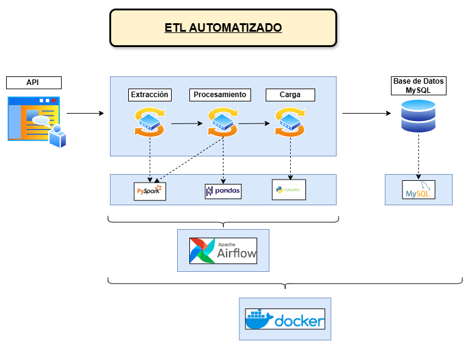

# 🌤️ Proyecto ETL Automatizado de Datos Climáticos
Este proyecto implementa un flujo ETL automatizado que extrae, transforma y carga datos meteorológicos de la API de Visual Crossing hacia una base de datos MySQL, orquestado mediante Apache Airflow y desplegado en contenedores Docker.

## 🚀 Descripción General

El objetivo principal del proyecto es automatizar el procesamiento de datos climáticos para obtener un histórico detallado de condiciones meteorológicas diarias y horarios de una ubicación específica.

---

## 🚀 Tecnologías utilizadas

- **Python 3.7**
- **PySpark**
- **Apache Airflow**
- **MySQL**
- **Docker & Docker Compose**
- **Pandas**
- **pymysql** para conexión con MySQL
- **python-dotenv** para manejo de variables de entorno
- **Gmail SMTP** para notificaciones de fallos automáticas

---

## 🧩 Arquitectura del Proyecto



    📌 Nota: Todo el flujo ETL se ejecuta dentro del mismo contenedor de Airflow `scheduler`, que orquesta las tres etapas mediante BashOperator.


---

### Descripción del flujo:

1. **Configuración inicial**
    - El usuario define las variables sensibles en `.env` y `api_key.txt`.
2. **Airflow DAG** 
    - El DAG programa la ejecución diaria automatica del flujo ETL a las 23:59 hs, ejecutando cada etapa mediante comandos dentro del contenedor `scheduler`.
3. **Etapa de Extracción** 
    - Se conecta a la API de Visual Crossing y descarga datos climáticos en crudo.
    - Los datos se almacenan como archivos `.json` dentro de la carpeta `/opt/airflow/Datos` del contenedor.
4. **Etapa de Procesamiento**
    - Se ejecuta dentro del mismo contendor Airflow `scheduler`.
    - Se utiliza PySpark para procesar los datos: limpieza, desanidamiento y explode de columnas, estructuración, reemplazo de nulos, asignación de IDs, eliminación de duplicados y creación de archivos intermedios.
    - Los archivos procesados se almacenan temporalmente en `/opt/airflow/tmp`.
5. **Etapa de Carga**
    - Dentro del mismo contenedor, se conectan los datos procesados con la base de datos MySQL.
    - Se crean tablas si no existen, se actualizan datos de manera incremental y se mantiene la trazabilidad de carga mediante la columna `fecha_carga`.
6. **MySQL Database**
    - Almacena los datos históricos para futuras consultas o análisis.
7. **Sistema de Notificaciones**
    - En caso de error en alguna de las etapas, Airflow envía una alerta automática por correo electrónico configurado mediante SMTP.

---

## 🐳 Arquitectura Docker del Proyecto
El proyecto está completamente containerizado para facilitar el despliegue y la portabilidad.
### *Docker Compose*: 
Todo el ecosistema se orquesta mediante `docker-compose.yml`, el cual:
+ Define la red interna de Docker para que todos los servicios se comuniquen.
+ Conecta Airflow con la base de datos Postgres y con MySQL.
+ Asegura que todos los contenedores se construyan y levanten en el orden correcto.
+ Monta volúmenes para mantener persistencia de logs, DAGs, plugins y la base de datos.

A través de `Docker Compose`, se levantan los siguientes contenedores que conforman la infraestructura:
- **Postgres**: Base de datos interna de Airflow utilizada para almacenamiento del metadato de ejecución de los DAGs y tareas.
- **Airflow Webserver**: Interfaz gráfica de Airflow para monitorear, controlar y gestionar la ejecución de los flujos de trabajo.
- **Airflow Scheduler**: Ejecuta todas las etapas del ETL.
- **Airflow Init**: Inicializa el entorno de Airflow durante el primer arranque, creando las tablas necesarias en la base de datos de metadatos.
- **MySQL**: Base de datos de destino donde se almacenan los datos procesados.
### *Dockerfile personalizado*:
El proyecto cuenta con un Dockerfile propio que extiende la imagen oficial de Airflow.
Este archivo se encarga de:
- Instalar dependencias necesarias para la ejecución del proyecto (PySpark, Pandas, PyMySQL, DotEnv, etc.).
- Configurar correctamente el entorno para ejecutar los scripts ETL dentro del contenedor scheduler.
- Garantizar que la imagen de Airflow esté lista para operar con MySQL y otras herramientas que el proyecto requiere.

--- 

# 🚀 Puesta en marcha del proyecto
1. **Clona el repositorio**
```bash
git clone https://github.com/tu_usuario/tu_repositorio.git
cd tu_repositorio
```

2. **Configura las Variables de Entorno**  
Crea un archivo .env en la raíz del proyecto (si ya existe, simplemente edítalo).
Allí deberás definir las credenciales y configuración de los servicios:

```
# MySQL
MYSQL_USER=usuario
MYSQL_PASSWORD=contraseña
MYSQL_HOST=mysql
MYSQL_DATABASE=nombre_database
MYSQL_PORT=3306

# Gmail SMTP para notificaciones de fallos
AIRFLOW_EMAIL_BACKEND=airflow.utils.email.send_email_smtp
AIRFLOW_SMTP_SMTP_HOST=smtp.gmail.com
AIRFLOW_SMTP_SMTP_STARTTLS=True
AIRFLOW_SMTP_SMTP_SSL=False
AIRFLOW_SMTP_SMTP_USER=tu_correo@gmail.com
AIRFLOW_SMTP_SMTP_PASSWORD=tu_contraseña_aplicacion
AIRFLOW_SMTP_SMTP_PORT=587
AIRFLOW_SMTP_SMTP_MAIL_FROM=tu_correo@gmail.com
```

3. **Construye e inicia los contenedores**  
Desde la raíz del proyecto, ejecuta:
```
docker-compose up --build
```

4. **Accede a la interfaz de Airflow**  
Una vez los contenedores estén corriendo, abre tu navegador y accede a:
```
http://localhost:8080
```

5. **Habilita y ejecuta el DAG**  
Activa el DAG llamado ETL-Diario desde la interfaz web de Airflow.

6. **Verifica la base de datos MySQL**  
Puedes acceder a tu base de datos MySQL con tu cliente favorito o vía terminal para verificar que los datos se estén cargando correctamente:
```
docker exec -it mysql mysql -u usuario -p
# Contraseña: contraseña
USE nombre_database;
SHOW TABLES;
SELECT * FROM nombre_de_tu_tabla;
```

---
## 👨‍💻 Autor

**Facundo Dispenza**  
Ingeniero y Analista de Datos.

- [LinkedIn](https://www.linkedin.com/in/facundo-dispenza)
- [GitHub](https://github.com/Facu6)
